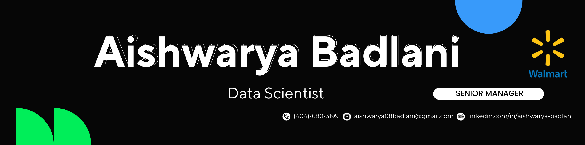

<!--Banner-->

<!--Night Owl image-->

  

<!--Header Name-->
#  ɪ'ᴍ AISHWARYA! 
*Senior Data & Analytics Leader*
  

<!--Start Intro-->               

I am a Data Science & Analytics Leader with over 10 years of experience driving business impact through data-driven strategies, predictive modeling, experimentation, and customer insights. I specialize in Python, Machine Learning, Cloud Platforms (GCP & AWS), A/B Testing, and Marketing Analytics.

- 📊 Turning data into business insights  
- 🧠 Learning AI, MLOps & experimentation at scale  
- 🏢 Led analytics teams at Walmart & The Home Depot  
- 🔍 Focused on retention, personalization & growth  
- ✍ Share real-world data strategy insights  
- 💼 Open to data & analytics leadership roles – [Let’s Connect](https://www.linkedin.com/in/aishwarya-badlani)

<!--End Intro-->

<!--Profile Count Badge-->

  

---

<!--Languages and Tools Section-->       
<h2 align="center">Tᴇᴄʜ sᴛᴀᴄᴋ & Work Experience</h2> 
<picture>
  <source media="(prefers-color-scheme: dark)" srcset="img\Skills_Animation_Dark.gif">
  <source media="(prefers-color-scheme: light)" srcset="img\Skills_Animation_White.gif">
  
</picture>
 

<h3 align="left">Current Learning</h3>
<ul align="left">
  <li>MLOps (Vertex AI, SageMaker)</li>
  <li>Customer segmentation & personalization</li>
  <li>Cloud analytics (GCP, AWS)</li>
  <li>Generative & Responsible AI</li>
</ul>

<h3 align="left">Work Experience</h3>
<ul align="left">
  <li><strong>Walmart – Sr. Manager, Analytics</strong> (2025–Now) A/B testing & insights @ Walmart.com (GCP)</li>
  <li><strong>The Home Depot – Manager, Data Science</strong> (2021–2025) Boosted retention with ML campaigns</li>
  <li><strong>Tractor Supply – Sr. Data Scientist</strong> (2020–2021) Delivered $5M+ lift via modeling</li>
  <li><strong>JTV – Data Scientist</strong> (2019–2020) Improved product recommendations</li>
</ul>

 
 

<!--Trophies Section-->   
<h2 align="center">🏆 Gɪᴛʜᴜʙ Tʀᴏᴘʜɪᴇs 🏆</h2>

  

<!--Github stats Table--> 
<h2 align="center">📊 Gɪᴛʜᴜʙ Sᴛᴀᴛs 📊</h2>

<table width="100%">
  <tr>
    <td width="50%">
      <h3 align="center"><strong>Gɪᴛʜᴜʙ Sᴛᴀᴛs</strong></h3>
      

        
      

    </td>
    <td width="50%">
      <h3 align="center"><strong>Sᴛʀᴇᴀᴋ Sᴛᴀᴛs</strong></h3>
      

        
      

    </td>
  </tr>
  <tr>
    <td width="50%">
      <h3 align="center"><strong>Lᴀᴛᴇsᴛ Pʀᴏᴊᴇᴄᴛ</strong></h3>
      

        
      

    </td>
    <td width="50%">
      <h3 align="center"><strong>Tᴏᴘ Cᴏɴᴛʀɪʙᴜᴛɪᴏɴs</strong></h3>
      

        
      

    </td>
  </tr>
</table>
 

<!--Contact Section--> 

<h2 align="center">🤝 Cᴏɴɴᴇᴄᴛ Wɪᴛʜ Mᴇ 🤝 </h2>

  

